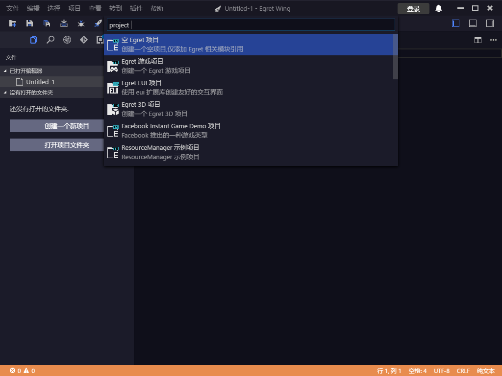
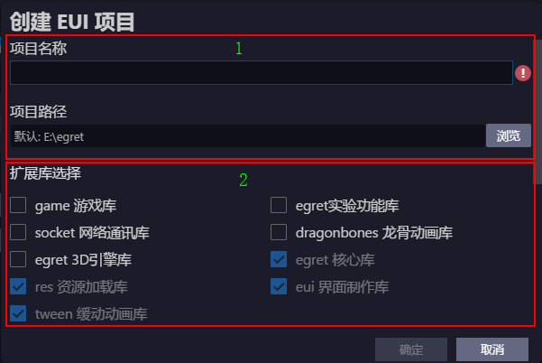
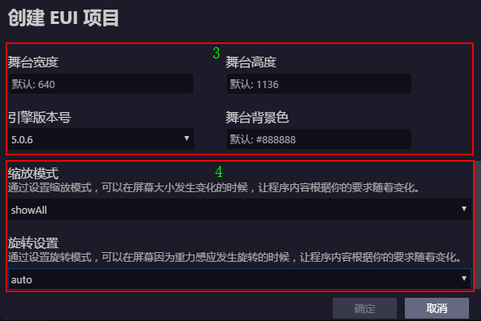
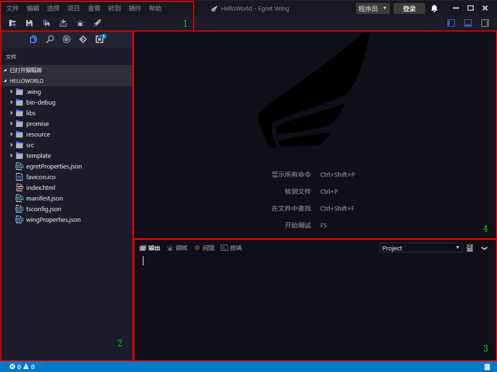
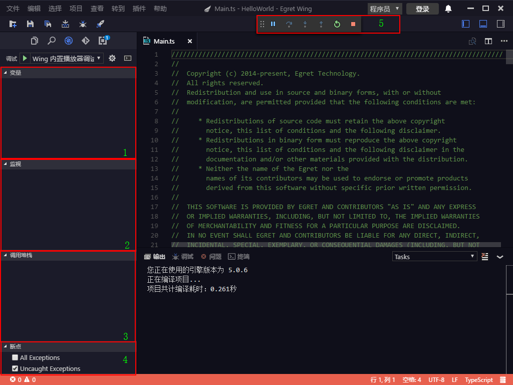
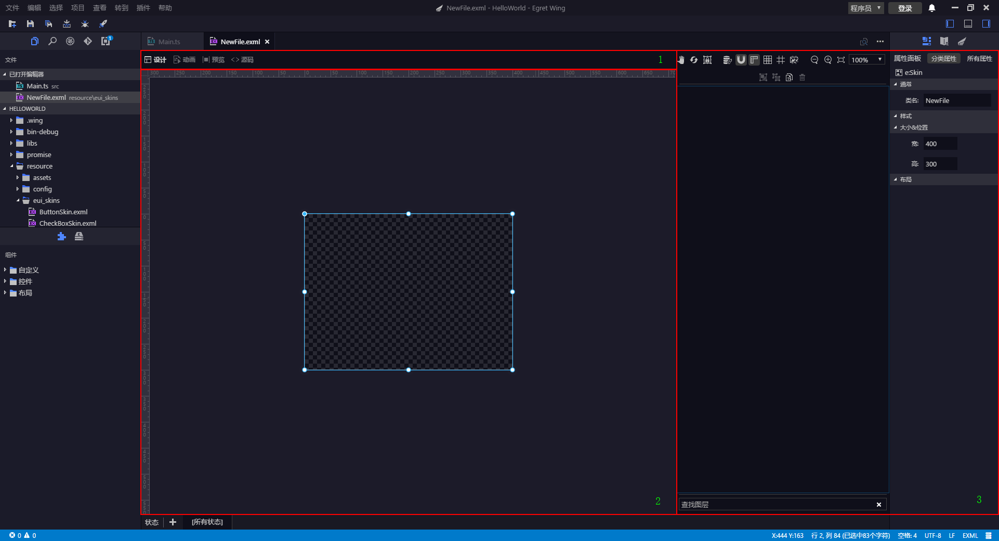

## Project creation
- Click on the navigation bar "File"-> "New Project", the "New Project" drop-down menu will pop up. ** as shown below: **"
	
	

- Select the project type, such as: empty Egret project, Egret game project, Egret EUI project, etc. Here Egret EUI project is taken as an example. In the drop-down menu of the above figure, select "Egret EUI project", "`Create EUI project`" panel will pop up, ** as show below: **

	
	
	
   - area 1: Set the project name and project path for the stage.

   - area 2: Project-dependent extension library.

   - area 3: Set the stage attribute and the engine version number.

   - area 4: Set the screen adaptation mode, including zoom mode and rotation mode.

- Click the 'Finish' button.

	**As shown below: ：**
	
	

   - area 1: Menu bar and toolbar

   - area 2: File directory

   - area 3: Project output log information
   	   
   - area 4: Code editing area
	

## Project operation

Under the `Project` tab of the menu bar:
	
- ### Construct
	- Compile the current project  

- ### Clean up
	- Clean up the project, clean up all files in bin-debug, then generate js

- ### Debug\F5
  ** As shown below:**
  	  
  
   - Click Project -> Debug 
   - area 1: variable
   - area 2: observation expression
   - area 3: call stack
   - area 4: breakpoint setting
   - area 5: debug operation, `continue`, `single-step skip`, `single-step into`, `single-step out`, `restart`, `finish`

[Click to view debugging details](../debug/inspector/README.md) 	

## Directory structure introduction
- wing project directory
		- .wing
			- launch.json
			- setting.json
			- tasks.json
		- bin-debug
		- libs
			- modules
				- egret
				- eui
				- res
				- tween
				exml.e.d.ts
		- promise
		- resource
			- assets
			- config
			- eui_skins
			- default.res.json
			- default.thm.json
		- src
		- templete
		- egretProperties.json
		- favicon.ico
		- index.html
		- tsconfig.json
		- wingProperties.json
		
For the role of each directory, please refer to the [document](../../Engine2D/getStarted/helloWorld)

## EUI related information

### New EXML
+ Right click on eui_skins

	**as shown below: **

	
+ Click the `Design 'tab.

  ** as shown below: **

	
	
	
	- area 1: The edit mode of eui, namely, `design`, `animation`，`preview` and `source code`.
	
	- area 2: Design area, animation editing, preview and source editing.
	
	- area 3: EXML's edit panel		
	    - Repository: The resources configured in default.res.json.
		
		- State: custom state, for example: TestButtonSkin.exml has three states, namely, up, downand disabled. The skin of individual state of TestButtonSkin can be set separately.
		
		- Components: system controls (Button, CheckBox, CheckBox and other components), layout components (Group, Panel, Scroller and ViewStack), custom components.
		
		- Layers: TestButtonSkin contains layers.
		
		- Attributes: Contain common, style, size and location, and layout.
		
  ** as shown below: **

	
	
	

- Details [EXML Visual Editing](../editor/exml/README.md) 

### Resource Management [Click Details](../editor/resdepot/README.md) 

	
	
	
