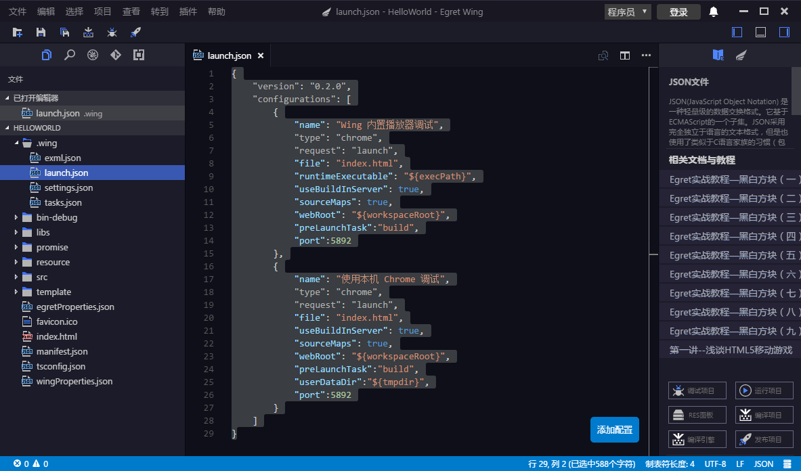
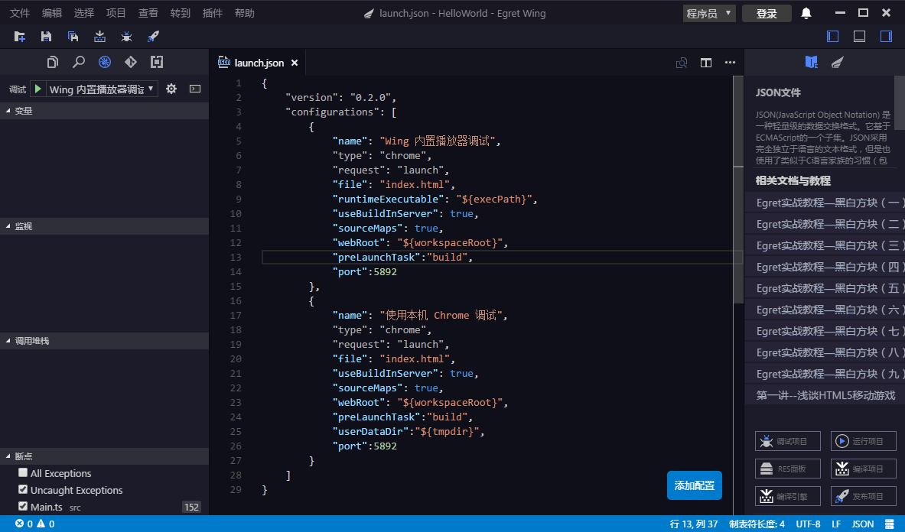
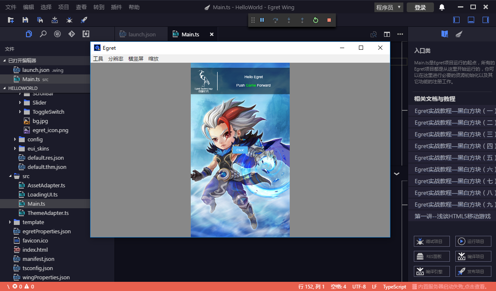
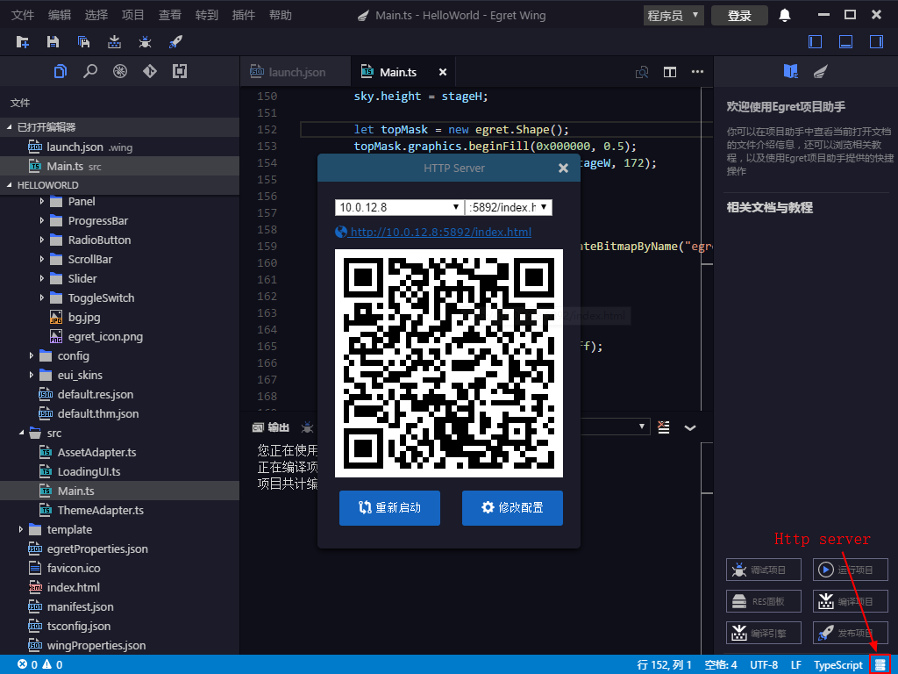

EgretWing supports debugging of JavaScript code in Chrome, or the program of Chome debug protocol.

## Debug mode
EgretWing supports three debug modes, namely, `Node.js`, `Chrome` and `EgretWing` extension development.


## launch
- Create Egret project debugTest [Egret 2D project guide](../../../Wing/2dImport/README.md)



After the project is created, configure debug information in launch.json under .wing folder.

Shown as above:

```
{
	"version": "0.2.0",
	"configurations": [
		{
			"name": "Wing built-in player debugging"",
			"type": "chrome",
			"request": "launch",
			"file": "index.html",
			"runtimeExecutable": "${execPath}",
			"useBuildInServer": true,
			"sourceMaps": true,
			"webRoot": "${workspaceRoot}",
			"preLaunchTask":"build",
			"port":5892
		},
		{
			"name": "Use native Chrome for debugging",
			"type": "chrome",
			"request": "launch",
			"file": "index.html",
			"useBuildInServer": true,
			"sourceMaps": true,
			"webRoot": "${workspaceRoot}",
			"preLaunchTask":"build",
			"userDataDir":"${tmpdir}",
			"port":5892
		}
	]
}
```

Click debug as follows:



- launch.json introduction
	- **name**  configuration name; a drop-down list that appears in the startup configuration. `Wing built-in player debug`, `use native Chrome debugging `.	- **type** EgretWing配置类型，`chrome`、`node`、`extensionHost`。
	- **request** type of configured Request. Valid values is `"launch"` or `"attach"`.
	- **file** debug debug entry file, the html file opened  in the browser.
	- **runtimeExecutable** The absolute path to the executable file. The default value is the run-time executable file on the PATH. Change to your Chrome installation path such as `C:\Program Files (x86)\Google\Chrome\Application\chrome.exe or /Applications/Google Chrome.app/Contents/MacOS/Google Chrome`.
	- **useBuildInServer** When true, EgretWing will launch a built-in web server.
	- **sourceMaps** Whether to use JavaScript source mappings (if it exists).
	- **webRoot** The root directory of the Web Service.
	- **preLaunchTask** The task that was run before the task was executed.
	- **port** The port number designted by Web Service.
	
- The operation is as follows:


## View the running results

### 1.1.Wing Wing built-in player
In the drop-down list of the started configuration, select `Wing built-in player debugging`. After clicking `debug`, you will see the running results in the built-in Wing player, as shown below.



### 1.2. Native Chrome

In the drop-down list of the started configuration, use the `Native Chrome debugging `. After clicking `debug`, you will see the running results in the native Chrome browser.

### 1.3. Mobile end

After compiling, click on the "Http server" in the bottom right corner, QR code will pop up, as shown below.



You can check the running results by scanning the QR code with mobile device.

> Mobile devices and devices that write code need to be in the same LAN.
