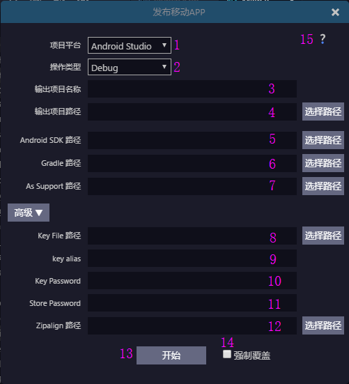

## Open

## Instructions for use
### android project
 
 
 * 1.Select the target platform, android (android studio, eclipse) and ios
 > ios can only be selected on Mac.
 * 2.Select the type of operation, debug and release, which only provide android version of the release. When ios is under debug and release, please go on with the follow-up operation in xcode after the implementation is completed
 * 3.Set the export name of the native project
 * 4.Set the export path for the native project
 * 5.It is ok to just set android sdk path to sdk.Example: /Users/helloca/Documents/androidSDK/adt-bundle-mac-x86_64-20140702/sdk
 * 6.It is ok to set gradle path to bin.Example: /Users/helloca/Documents/gradle-2.12/bin
> Note: Since eclipse platform corresponds to the set ant path, it is ok to just set to the bin. For example: /Users/helloca/Documents/apache-ant-1.9.7/bin
 * 7.android studio version of the support path.Example: /Users/helloca/Documents/egret-android-support-as
> Note: eclipse platform corresponds to the eclipse version of the support path
 * 8.The path of signature file, which is used for android release.
 * 9.The alias of the signature file, which is used for android release.
 * 10.The key password of the signature file, which is used for android release.
 * 11.The store password of the signature file, which is used for android release.
 * 12.The path of zipalign tool, and it is ok to just specify the path to its parent, which is user for android release.Example: /Users/helloca/Documents/androidSDK/adt-bundle-mac-x86_64-20140702/sdk/build-tools/22.0.1
 * 13.Start button, click to start implementing the corresponding debug or release operation
 * 14.Forced override options
    * When you copy the project to another computer or location, you want to continue the packaging test.Check the `Forced overwrite` option to automatically delete existing records, and then regenerate the corresponding project.
    * When exporting, please close all access to the native project directory and file, thus preventing the failure to write or delete due to occupation, especially under Windows.
 * As forced coverage will delete the folder and all its contents, please use this function with caution.
 * 15.Help, click to open the link of the help document in the browser.
 * When android is engineering debug, it will automatically find the connected device after the construction is completed.If the device is found out, it will automatically install the apk file.Please check whether the device is connected and has opened the usb debugging function. If not, please install it manually after the construction is completed.

### ios works

 * 1.Select the corresponding operation, such as debug, release
 * 2.The support path of ios version
 
#### Note:
   * The path can not contain Chinese or spaces.
   * For Windows system, it is not recommended to put the dependencies under the system disk.
   * After ios is constructed, please use xcode to open ios project, and then click on the test in xcode or release officially.
   * For xcode test, it is recommended that real machine is directly connected for testing.Now the real machine test is free and needn't to buy Apple developer account.
   * When xcode is officially released, a formal developer account and certificate are needed. Please purchase by yourself.
   
## Dependent conditions:
## Android
## Required:
 * 1.The latest version of egret engine [Click to download](http://www.egret.com/products/engine.html) 
 * 2.android sdk [Download of Mac version] (http://pan.baidu.com/s/1dD8WUL7) [Download of Windows version] (http://pan.baidu.com/s/1gdsDRn9)
 * 3.java sdk [Download of Mac version](http://www.oracle.com/technetwork/java/javase/downloads/jdk8-downloads-2133151.html) [Download of Windows version](http://www.oracle.com/technetwork/java/javase/downloads/jdk8-downloads-2133151.html)

#### Choose one of the following two methods:
* eclipse packing method
	* 1.ant [Click to download](http://ant.apache.org/bindownload.cgi)

	* 2.egret-android-support of eclipse version [Click to download](http://www.egret.com/products/products-others.html#egret-support)

* android studio packing method
* 1.gradle [Click to download](https://services.gradle.org/distributions)

* 2.egret-android-support of android studio version [Click to download](http://www.egret.com/products/products-others.html#egret-support)

### iOS
* 1.egret engine [Click to download](http://www.egret.com/products/engine.html) 
* 2.egret-ios-support [Click to download](http://www.egret.com/products/products-others.html#egret-support)
* 3.xcode