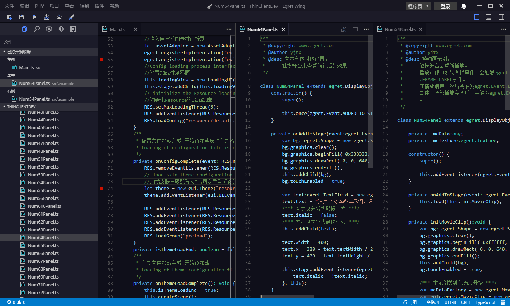
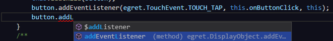
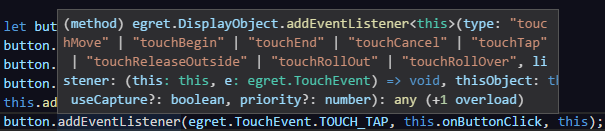
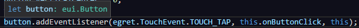
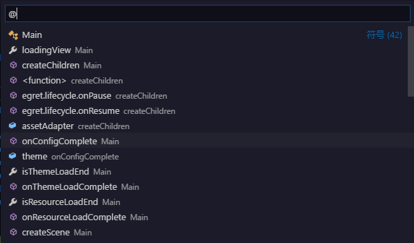
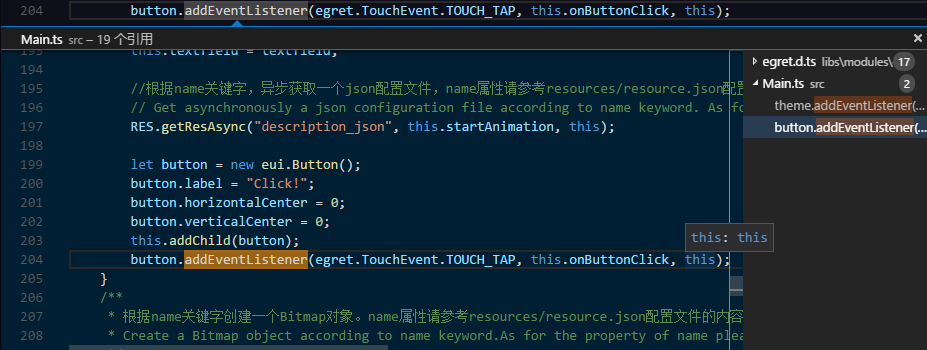
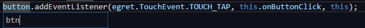
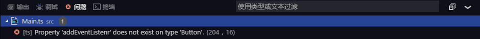

## Multiple editor edits ##

EgretWing allows up to three editors to be opened at the same time, and displayed side by side in the editor.

If you have already opened an editor, there are several ways to open a new editor on the right side of the editor:

- Hold down the `Ctrl` key (`Cmd` key on Mac) in the File tab and click the file you want to open
- Use the shortcut key `Ctrl + \` in the currently activated editor to divide the current editor into two parts
- Right click on the Menu of the folder tab, then select **Open in the new editor**

## smart prompts ##

EgretWing supports multi-language auto-completion features such as: JavaScript, JSON, HTML, CSS, Less, Sass, C# and TypeScript.

## Parameter prompt ##

In JavaScript, TypeScript, you can see the type and annotation of the current input parameter when you enter the parameters of the method.If it is overloaded, you can select the required parameters through `up` arrow and `down` arrow shortcut keys .

## Suspension prompt ##

When the mouse is moved above the text, a pop-up prompt box will appear if the character is a variable or the css selector in the following example, .

##  Jump to definition ##

If the language supports, you can press the shortcut key `F12` to jump to the variable or method definition of the cursor location.

You can also press the `Ctrl` key to move the mouse over a variable or method, the method definition details will be displayed.

> You can also use `Ctrl+Click` to adjust to the definition, or use `Ctrl+Alt+Click` to open the definition in the new editor.If you open a new editor window, you can use `Ctrl+Alt+Left` to return to the previous editor.

## Quick outline ##

Use the shortcut keys `Ctrl+Shift+O` to open the Quick Outline panel, which displays all the classes, methods, and variables defined in the current file.

## Find reference ##

By executing **Find all references** (shortcut key `Shift+F12`) commands, you can find all the locations where the current variable or method is referenced .

## Rename the variable ##

Some languages (such as TypeScript) support global rename variables.If you use the shortcut key `F2` to enter the new name of the variable and press` Enter`, all the locations that use the variable in the project will be renamed.

## Error and warning ##

When any syntax error or warning happens to the file, error message will be prompted. With the shortcut keys `Ctrl + Shift + M`, you can view all the errors. In the error panel, you can also view the errors that have appeared.

## Multiple choice ##

EgretWing supports multiple cursors and can quickly edit similar text. You can use the `Alt + Click` shortcut to add multiple cursors, each of which is independent. You can also use the `Ctrl+Alt+Down` or `Ctrl+Alt+Up` to insert the cursor below or above.

## Cross-line selection ##

You can select multiple lines of text by press and holding `Shift + Alt` to move the cursor。 .

## Code folding ##

You can use the Fold icon that is to the right of the line number to fold the code.

You can also use shortcut keys to fold and expand the code:

- Fold  (`Ctrl+Shift+[`)
- Expand (`Ctrl+Shift+]`)
- Collapse all (`Ctrl+K Ctrl+O`)
- Expand (`Ctrl+K Ctrl+J`)

## Common shortcuts ##

There are many useful shortcuts in the EgretWing editor:

- Switch to the previous editor (`Ctrl+Tab`)
- Switch to the previous edit position (`Alt+Left`)
- Format code (`Shift+Alt+F`)
- Delete the current line (`Ctrl+Shift+k`)