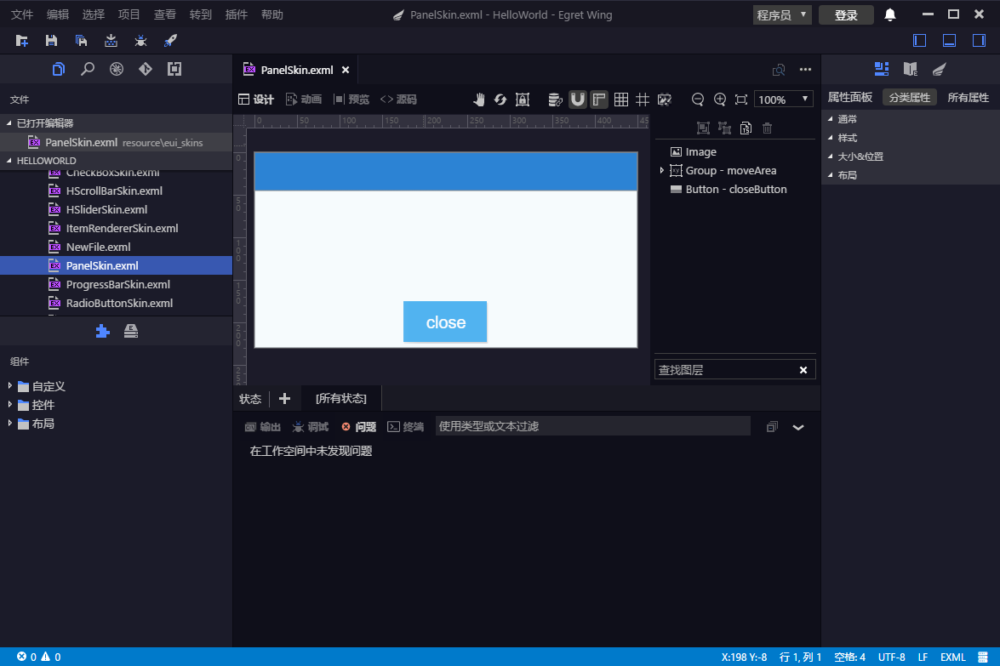
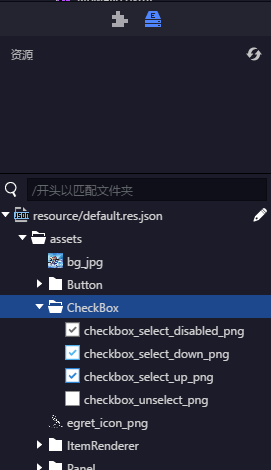
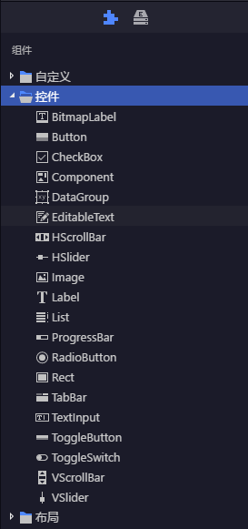
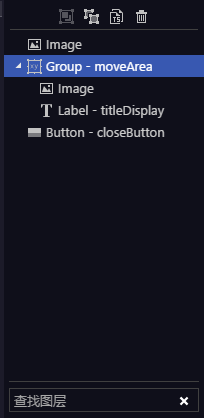
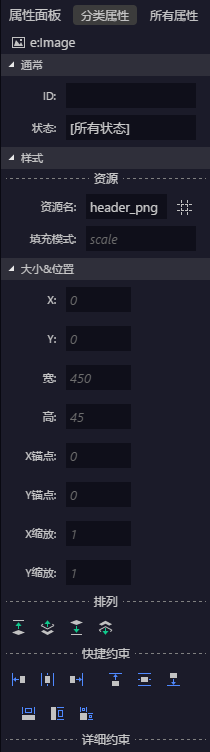

## Introduction
Egret Wing Exml visual editor is a mixed editor featured by code editing, visual editing and skin preview, which is specifically designed for Exml skin in the EUI project.

The editor can visually edit the Exml skin of Eui in a more convenient and efficient manner, with editing methods including but is not limited to pulling, dragging and so on.The visual editor consists of two main parts:
* Edit the document area
* Edit the relevant panels

## Preconditions
Before using the Exml visual editor, your project needs to meet the following conditions:
* Must be an Egret project
* The UI library used by the project must be Eui
* Make sure that the configuration of resources and topics in wingProperties.json is correct.
* The file you open must be Exml

## How to open it
You can visualize the Exml skin after all the above preconditions are met.The following is a screenshot of the open PanelSkin.exml file in the Eui example project:

View Mode: The mode for displaying Exml in the document area.Among them are "source code", "design", "animation" and "preview".
* View Mode - The source code: It refers to the view mode for text viewing of an Exml skin in the document area.
* View Mode - Design It refers to the view mode for visualizing and editing an Exml skin in the document area.
* View Mode - Animation It refers to the view mode that animates an Exml skin in a document area.
* View Mode - Preview It refers to the view mode in which an Exml skin is previewed in the document area, under which all skin components are interactive.

## Resource panel

The resource panel displays all the resources that can be loaded in the current project, and the resources in the repository depend on the resource plugins used by the project. You can also drag and drop the resources in the repository panel to the design view mode of the document area to create the Image.
## Component

The component panel contains a list of all the components that can be used in the current project. The categories are "Controls", "Layouts", "Custom".You can create a component in the design view of the document area by dragging it.

## Layer

The panel shows the hierarchy of all the components the Exml skin file that is being edited in the current document area.With the panel, you can quickly select the corresponding component in the document area.With the panel, you can also more intuitively adjust the hierarchical structure between components in the document area.

## Status

With the "state" panel, you can easily view the rendering effect of Exml skin in various states. At the same time you can switch to different states to edit the Exml skin.For example: button's four states, namely, normal, over, down and disabled.

It is important to note that "[all states]" is not what can be seen in the Egret program, instead, it is designed to facilitate the usage of the Wing preview state by the user. Therefore, it won't be compiled into the program.What you can see in the Egret program is the state other than "[all states]".So you need to pay attention to the currently selected state when editing.

## Attributes

You can directly manipulate the properties of the currently selected component through the Properties panel.