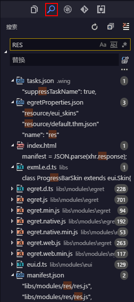

The search tab on the left column allows you to search all the files and content in the current workspace, and supports Advanced Settings options such as regular expressions, pattern matching and filtering.

