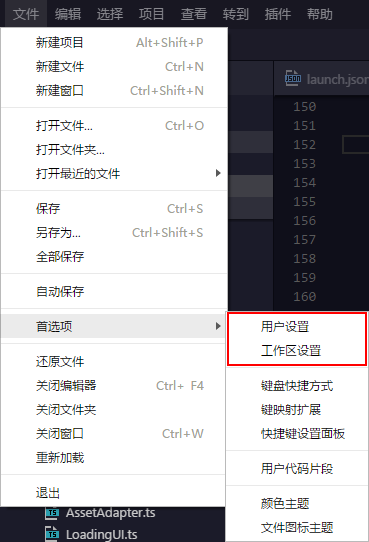

EgretWing provides nearly 200 setting items including **editor settings, file settings and window settings** to meet a variety of user habits.The common settings are as follows:

    // Font.
    "editor.fontFamily": "",
    // Font size.
    "editor.fontSize": 0,
    // Show line number
    "editor.lineNumbers": true,
    // the number of spaces equivalent to a tab
    "editor.tabSize": 4,
    // Insert space when pressing "tab"
    "editor.insertSpaces": true,
    
    // Read or write the file's default encoding format.
    "files.encoding": "utf8",
    // Default line break
    "files.eol": "\r\n"

You can open **User settings** or **Workspace setting** through menu bar, namely, **File—Preferences** menu

Settings are divided into **User settings ** and**Workspace settings**.User settings are global and can take effect anywhere, and user settings will override the default settings.The user settings are saved in the settings.json of the user cache directory.
Workspace settings are for a folder, which is only valid for the current workspace. The workspace settings will override the user settings.The workspace settings are saved in the .wing/settings.json under the current workspace.
So the final priority is **Workspace settings> User settings> Default settings**.

The current settings can be changed by modifying `settings.json` file.For example, I used to configure the user as follows

{
"editor.insertSpaces": false,
"files.eol": "\n",
"window.openFilesInNewWindow": false,
"tslint.enable": false
}

The exact meaning of the function represented by each field can be found in the field description in the default configuration.