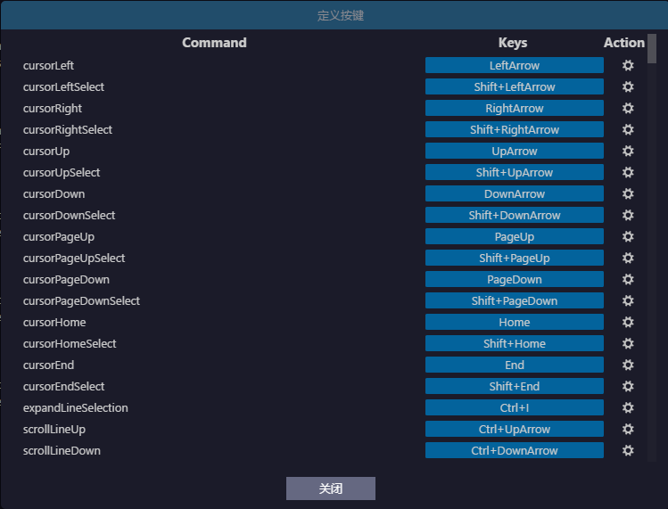
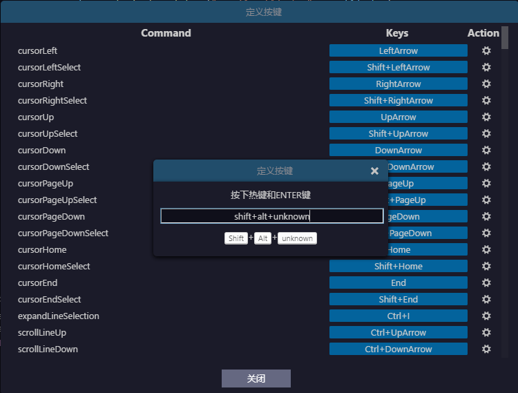

EgretWing provides shortcuts for nearly 300 custom commands of shortcut key setting items.You can open the **Shortcut key settings panel** option via the menu bar, then `File - Preferences' menu, as shown below.

The method for setting the shortcut key:

- Find the corresponding command, then click on the Modify button on the right side, as shown below:

   

- Press the shortcut key you want to set and **Enter** key.