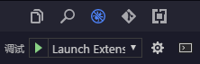

We offer a variety of methods for plug-in project debugging.Here are two ways

# Debug the plugin project with EgretWing

Switch to the debug bar, and then select the Launch Extension from the drop-down list, and finally press the Start button or F5 to start the debugging.

And then directly set up breakpoint on the ts source code.

This method is strongly recommended.

# Use the node-inspector to debug the plug-in project

As with other common NodeJS` projects, you can debug the Wing plugin project with [`node-inspector`] (https://github.com/node-inspector/node-inspector) and [` chrome browser `] (http://www.google.cn/chrome/browser/). 

## Install the node-inspector

Use the `npm` command to install the node-inspector to the global location

$ npm install -g node-inspector

## wing command line parameters

If you want to debug the specified plugin, you need to start the wing with a specific command line argument.

Option | Default | Description
---- |:--------:| ---- 
`--debugPluginHost` | 5870 | The port number of the debugging plugin
`--extensionHomePath` |   | Specify the root directory of the plugin, which contains one or more plugins
`--extensionDevelopmentPath` |   | Specify the directory of the current plugin, which is the path of the plugin being developed

## Start debugging

The following example of Windows to start debugging process. If the location of the plugin to be debugged is

D:\workSpace\wing-extensions\skinpartids

First, find the the path of wing executable program, then start wing with the command line parameter.

The default executable path for Windows is

D:\Program Files\Egret\EgretWing\EgretWing.exe

The default executable path for Mac is

/Application/EgretWing.app/Contents/MacOS/EgretWing

Then the command line for starting the Wing debugging

$ "D:\Program Files\Egret\EgretWing\EgretWing.exe" --debugPluginHost --extensionDevelopmentPath="D:\workSpace\wing-extensions\skinpartids"

The above command specifies the location of a specific plugin and enables the 5870 port, waiting for the debugger to connect.

## Start node-inspector

Then open a command line window, and start node-inspector

$ node-inspector --debug-port=5870

Follow the prompts to open the `Chrome browser` access URL

http://127.0.0.1:8080/?ws=127.0.0.1:8080&port=5870

Switch to the `Sources`  tab to see the relevant source code and set breakpoints at any location.

> Note: 
>- If the source code of plugin can't be found in the `Sources` tab, it is likely that the plugin has not yet been activated and the corresponding code has not yet been loaded.Then, you just need to activate the plugin by executing the command of activating the plugin for one time in wing.And then you can see the plug-in code by refreshing the browser page.
If you have enabled `sourcemap` in the `tsconfig.json` compiler option in the plugin, you can set up a breakpoint directly on the ts code.