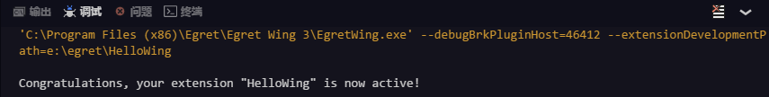

This article will guide you on how to create, build, debug and publish a wing plugin project through a simple plugin example project (HelloWing).

HelloWing plugin adds a `command`, and the executive command will output` Hello Wing` in the console.

### Create a plugin project

**1**. Open the Wing `File` - `New project` menu, then select `extension project`.

Enter the project name HelloWing and click Finish.

** 2 **. During the project plug-in process, Dependency module will be installed automatically, then a new window will be opened to edit the displayed items.

** 3 **. Create plugin entry `extension.ts` and entry method `activate`.

	export function activate() {
    	    
	}


> Each plugin requires an entry ts and the entry method `activate` to activate the plugin.The location of the entry ts is defined in `package.json`.

** 4 **. Modify `tsconfig.json` to set the parameters required to compile the project.Take this project as an example. The contents are as follows:

	{
		"compilerOptions": {
			"module": "commonjs",         //定义编译使用的模块规范。'commonjs'或者'amd'
			"outDir": "out",              //定义js文件输出目录。
			"sourceMap": true,            //是否生成sourceMap。
			"noLib": true,                //是否包含默认库文件
			"moduleResolution": "node"    //模块解析策略。 node或者classic。
		},
		"exclude": [
			"node_modules"                //编译器排除的目录。
		]
	}

> For more information about `tsconfig.json`'s reference [official documentation] (https://github.com/Microsoft/TypeScript/wiki/tsconfig.json)

** 5 **. Modify the the basic information of the definition plugin `package.json` in the root directory of the project.The basic contents are as follows:

```
{
	"name": "hellowing",
	"description": "A Simple Extension For Egret Wing.",
	"version": "1.2.0",
	"publisher": "egret",
	"categories": [
		"Other"
	],
	"icon": "images/icon.svg",
	"bugs": {
		"url": "https://github.com/egret-labs/wing-extensions/issues"
	},
	"homepage": "https://github.com/egret-labs/wing-extensions/blob/master/README.md",
	"repository": {
		"type": "git",
		"url": "https://github.com/egret-labs/wing-extensions.git"
	},
	"license": "MIT",
	"activationEvents": [
		"onCommand:extension.helloWing"
	],
	"engines": {
		"wing": "^3.0.4"
	},
	"main": "./out/extension",
	"contributes": {
		"commands": [
			{
				"command": "extension.helloWing",
				"title": "Hello Wing"
			}
		]
	},
	"scripts": {
		"wing:prepublish": "node ./node_modules/egretwing/bin/compile",
		"compile": "node ./node_modules/egretwing/bin/compile -watch -p ./",
		"postinstall": "node ./node_modules/egretwing/bin/install"
	},
	"dependencies": {},
	"devDependencies": {
		"egretwing": "^3.0.4",
		"typescript": "^1.7.5"
	}
}
```

> For more information about `package.json`'s description, please refer to [plugin description file](../../../Wing/plugin/configDes/README.md)


### Write plugin code

**1**. Register in `package.json` [Plugin extension point](../../../Wing/plugin/extendPoint/README.md).This example creates a `extension.helloWing` command.The corresponding code in `package.json` is as follows:

	"contributes": {
		"commands": [
			{
				"command": "extension.helloWing",
				"title": "Hello Wing"
			}
		]
	}

**2**. 在`package.json`中定义[激活事件](../../../Wing/plugin/activation/README.md)。当执行`extension.hellowing`命令时激活插件。在`package.json`对应的代码如下：	**2**. Define [Activation event] in `package.json` (../../../Wing/plugin/activation/README.md).Activate the plugin when executing the `extension.hellowing` command.The corresponding code in `package.json` is as follows:

	"activationEvents": [
		"onCommand:extension.helloWing"
	]

**3**. Next, code writing will begin.In the activation method `activate`, register the implementation method of the `extension.hellowing` command.In the console, output `Hello Wing` message..The code is as follows:

	import * as wing from 'wing';

	export function activate() {
		console.log('Congratulations, your extension "HelloWing" is now active!');
		wing.commands.registerCommand('extension.helloWing', helloWing);
	}
	
	function helloWing() {
	    wing.window.showInformationMessage("Hello Wing");
	}

> `import * as wing from 'wing';` After this sentence imports the `wing` module, you can use the api. defined in `wing.d.ts`. 

> `wing.commands.registerCommand` This sentence means the corresponding implementation method of the registration command.

> Here, besides the usage of api in `wing.d.ts` and `node.d.ts`, you can even achieve a variety of functions by downloading third-party modules with npm.

### Compile the project

Use the Ctrl/Cmd + Shift + B ** to compile project in Wing.The compiled js code will be outputted to the `out` folder under the project root directory.

### Test plugin

Wing provides convenient [debug plugin](../../../Wing/plugin/debug/README.md) to support plug-in testing and debugging.

If the boot succeeds, the `debug` panel below will output:

	'C:\Program Files (x86)\Egret\Egret Wing 3\EgretWing.exe' --debugBrkPluginHost=46412 --extensionDevelopmentPath=e:\egret\HelloWing 

And open a new Wing window.

This indicates that Wing has recognized and is loading the `hellowing` plugin.

In the new window, use the `Ctrl/Cmd+Shift+P` shortcut keys to open the command panel and execute the `hellowing` command.You can see the following output in the `debug` panel:



At the same time, message prompt column will pop up at the top of the new window, as shown below:


### Release plugin

Click on the menu bar `Plugin` - `Plugin management` - `Publish plugin`, `hellowing-1.2.0.wext` file will be generated in the project root directory 

Share the generated `.wext` file to the [Egret forum] (http://bbs.egret.com)] (https://github.com/egret-labs/wing-extensions).

> You can define the exclusion files in the `.wingignore` file in the project when you publish.
