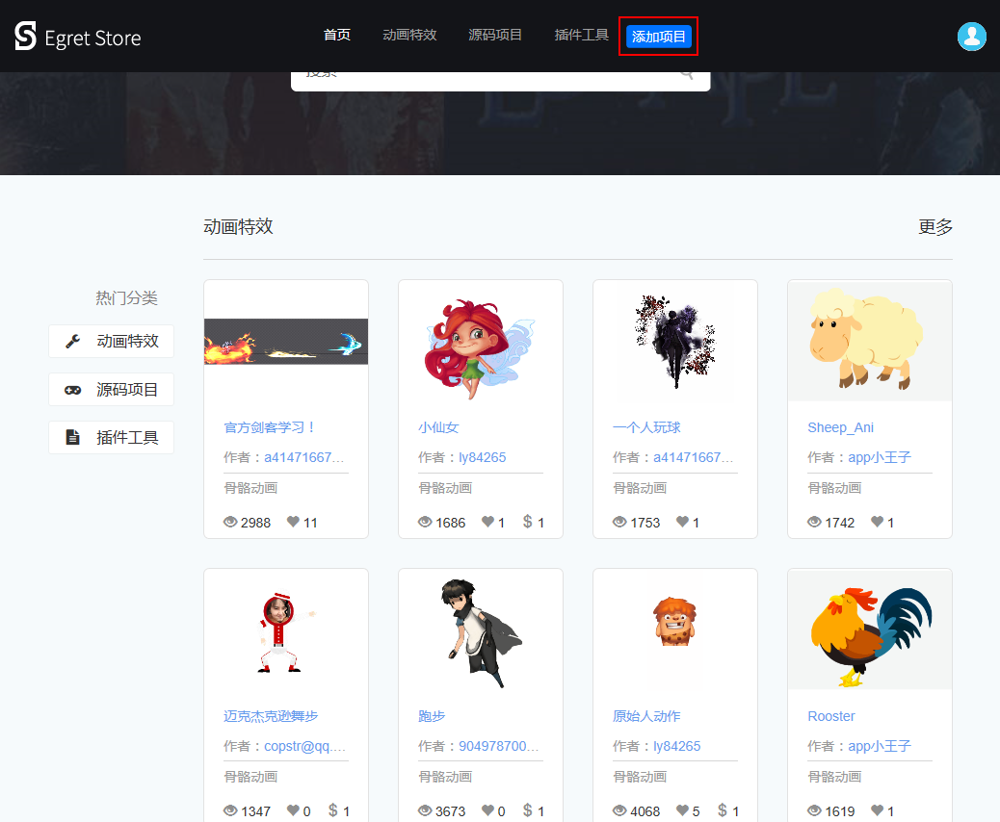
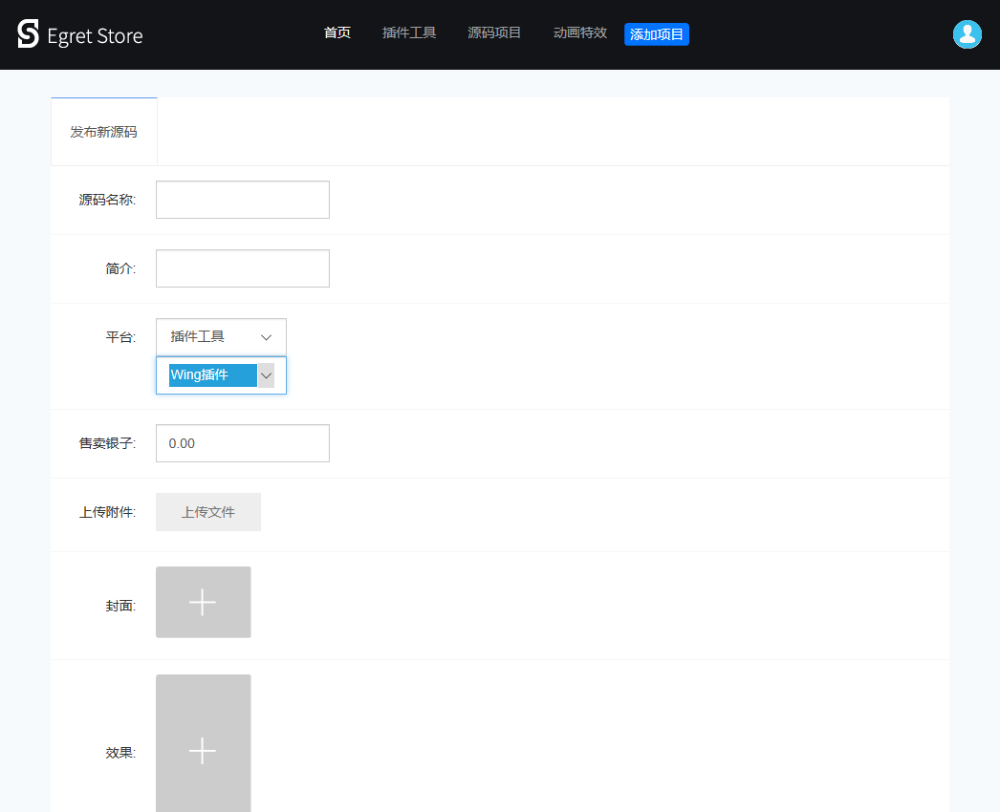
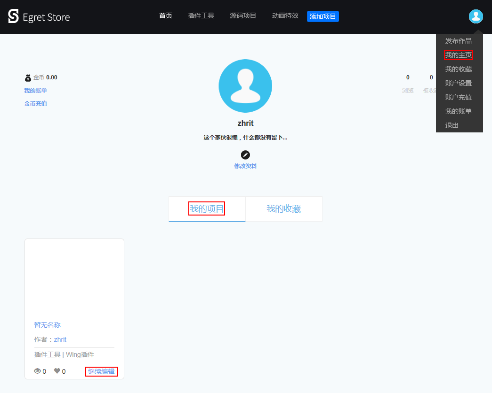
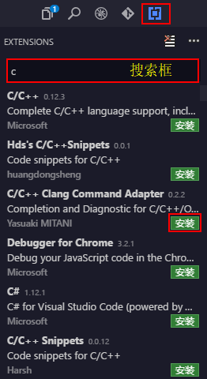

## 打包插件
在`.wingignore`中配置好发布要排除的文件或文件夹。 
点击菜单栏`插件` - `插件管理` - `发布插件`，或使用 `Ctrl/Cmd + Shift + P` 打开命令面板，键入 `Package`。

发布完成后会在项目目录下生成后缀为`.wext` 的插件文件格式。

您可以将发布后的文件分享给其他用户，手动安装。或者上传到 Egret Store 让所有的开发者下载使用。

### 上传到 Egret Store
在浏览器中打开 [Egret Store](http://t.egret.com/work)。

用您的 Egret ID (论坛或 Egret Store 账号)登录。

点击上方的“添加项目”按钮。

填写所需的信息。其中在`平台`中选择`插件工具` - `Wing插件`。

为了保证 Egret Store 中插件的可用性，上传成功后请等待工作人员的审核。

### 更新 Egret Store 中的插件版本

需要更新线上版本的时候，可以点击您的用户名，打开`我的主页`。

在`我的项目`中找到要更新的插件，点击插件下放的“继续编辑”按钮。

在打开的编辑作品面板中，选择新版本的插件，编辑相关资料，上传源码。编辑完的作品，需等待管理员审核。

## 安装插件

点击  `Extensions`
在搜索框中输入关键词搜索插件。
找到插件，点击右下角的安装即可。

