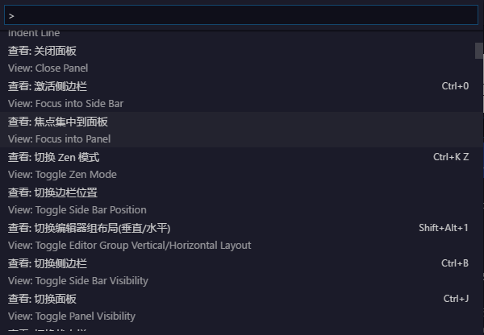

Command panel can easily find and execute the command, use the shortcut keys **F1** or **Ctrl+Shift+P** call-out panel.

Each item of the panel is a command. If the command has a shortcut key, the corresponding shortcut key will be displayed on the right.