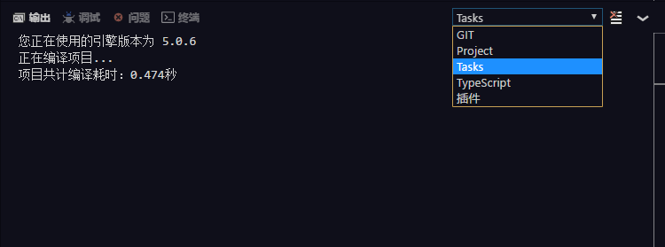

The output panel displays some prompt messages, showing the current operating status.The output panel has multiple channels (`Channel`) for distinguishing different sources of output.

For example, Tasks channel will output information related to the project compilation process, GIT channel will output information involved in the Git implementation process, and Project channel will output information relevant to the creation of project.

