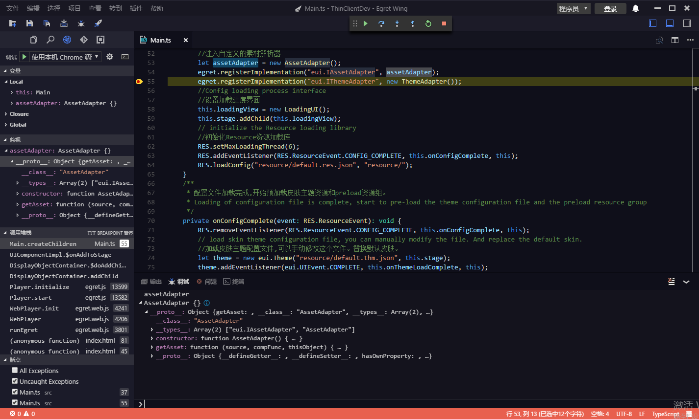

If `launch.json` has been configured, debugging can be started with the shortcut key ** F5 ** or ** debug panel**.In debug mode, ** variable, monitoring, call stack, and breakpoint ** fold menu in the Debug tab are all available.

Debug panel shows the output and error message in the process of program running.  Also, the expression can also be entered in the input box below and dynamically executed to get the results.This panel is similar to the Console panel function of the Chrome developer tool.

